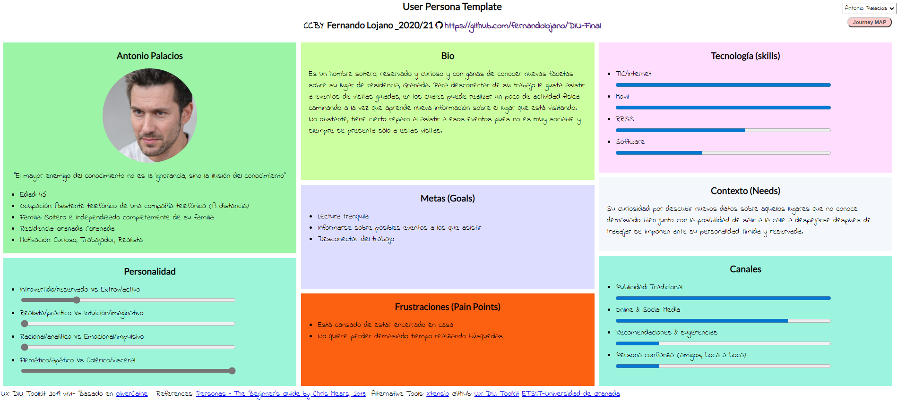
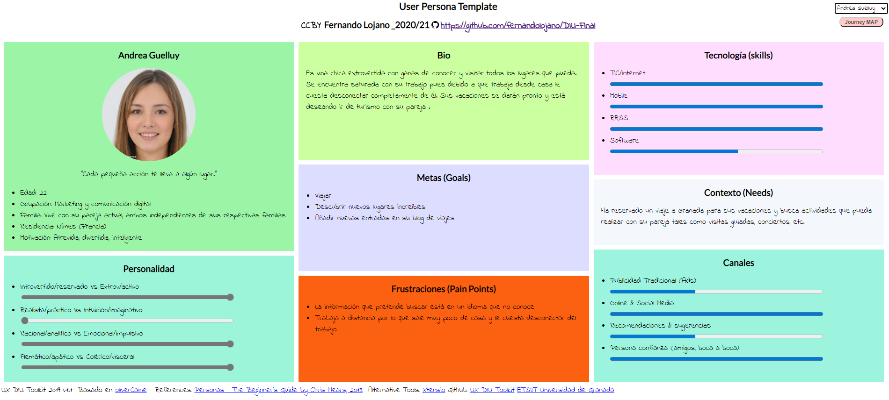
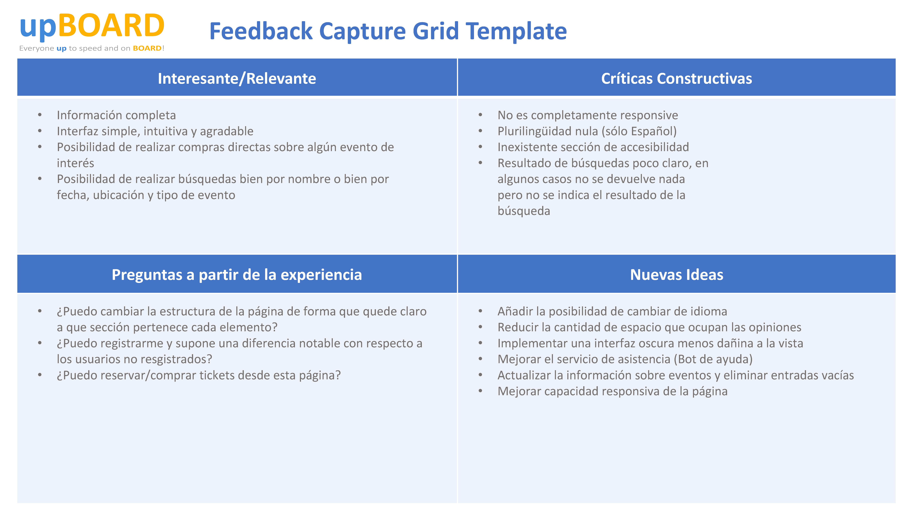
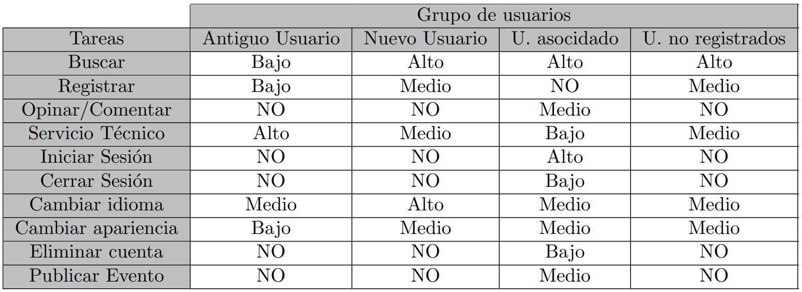

# Trabajo final
Trabajo final 2020-21: Resolución de un problema, caso y/o supuesto práctico.
Descripción :
Repositorio dedicado a la realización del trabajo final de la asignatura Diseño de interfaces de usuario.

Autor:
 * :bust_in_silhouette: Fernando Lojano Mayaguari      :octocat: fernandolojano

# Mi experiencia UX

Describe con una extensión entre 800-1200 palabras de tu experiencia en IU/UX/Usabilidad, pudiendo
destacar: :
● Aportaciones/contribuciones en contexto de ejercicios/actividades de clase con una valoración
de la calidad de esas contribuciones
● Aportaciones destacables en contexto de prácticas que sean destacables por su calidad o
relevancia
● Otras aportaciones (en ámbitos de otras asignaturas, profesionales, etc.)
Por ejemplo, no vale indicar que se ha hecho un ejercicio etnográfico, sino que se debería explicar qué
se ha aportado ese ejercicio, conclusiones destacadas relacionadas con contenido de asignatura, etc. Lo
mismo con las prácticas.
El resultado de esta parte es tener una (auto) valoración del grado de experiencia adquirido (sabiendo
justificarlo) en el área de UI/UX.

# Caso de estudio: Web Yuzin

## Análisis competencia
Para poder realizar un análisis de competencia correcto, se han escogido dos páginas web cuyo propósito de existencia es el mismo que [Yuzin](http://www.yuzin.com/). Estas páginas son [madridcultura](https://www.madridcultura.es/) y [amexessentials](https://www.amexessentials.com/). Los resultados del análisis obtenidos son:

En esta tabla se puede ver como, a pesar de presentar ciertas desventajas como la ausencia de una sección de accesibilidad y de lenguajes adicionales al principal, la puntuación total que obtiene [Yuzin](http://www.yuzin.com/) es mejor que el resto de las páginas que se han analizado. La página destaca sobre todo en la información que provee así como la sencillez del proceso de contacto con el personal de la página. Pero sobre todo, su utilidad es mayor que las otras dos páginas debido a que incluye la opción directa de compra de tickets para los eventos que muestra.

## Experiencia de Usuario
Se han creado dos personajes ficticios que harán uso de la página:

1. Antonio Palacios
 Antonio Palacios trabaja de asistente telefónico en una compañía telefónica. Es reservado y algo tímido, por lo que no tiene demasiados amigos y casi a perdido el contacto con ellos tras pasar toda la pandemia encerrado en su apartamento. Su lugar de trabajo actual es su propio apartamento, que si bien es lo suficientemente grande para el sólo, no le quita la sensación de encontrarse aislado completamente. Para desconectar del trabajo, le gusta dar largos paseos por su ciudad y, de vez en cuando, asistir a alguna ruta guiada en la que además de realizar ejercicio físico, puede aprender más sobre los lugares por los que está caminando. Si bien le gusta asistir a las rutas guiadas, siente un poco de recelo y vergüenza cada vez que intenta asistir pues lo hace el sólo sin ningún acompañante. Este usuario se dispone a usar la página para buscar información sobre algún evento al que pueda asistir, no obstante, cabe recalcar que era usuario anterior de la versión antigua de la página web, por lo que se encuentra visiblemente impactado debido al nuevo cambio de apariencia y funcionalidad de la página.
 
 

 2. Andrea Guelluy
 Andrea es una chica francesa completamente independizada de su familia que vive actualmente con su pareja. Trabaja en la sección de marketing de una grande empresa francesa. No obstante, por seguridad debido a las situaciones médicas actuales, trabaja actualmente a distancia, por lo que le cuesta desconectar del trabajo. Dirige un blog personal sobre viajes y reseñas de los lugares que ha visitado y los eventos a los que ha asistido. Dentro de unas semanas va a tener las vacaciones asignadas de verano y quiere salir de Francia y desconectar completamente del ambiente que le rodea. Para ello, ha reservado un viaje a Granada para ella y su pareja. Quiere buscar eventos o visitas guiadas a los que poder asistir una vez que esten allí y por casualidad, ha acabado en [Yuzin](http://www.yuzin.com/). No conoce la versión anterior de la página por lo que no sabe los cambios realizados durante el re-diseño anterior.
 
 
  

## User Journey map

1. Antonio Palacios
Este usuario comenzará a utilizar esta página como entretenimiento y obtención de información, con el objetivo y esperanza de encontrar algún evento que le pueda resultar de interés. Como se ha mencionado anteriormente, era usuario de la antigua versión de esta página web y esta vez al acceder a la página, se muestra sorprendido pues no se parece en nada a la versión anterior. Al principio navega perdido por la página web, sin buscar nada en especial, sólamente saciando su curiosidad ante los nuevos cambios. 
Finalmente, decide buscar algún evento. Se fija en que existe una opción para buscar eventos en Sevilla. Antonio, ni corto ni perezoso, decide realizar una búsqueda sobre cualquier evento que se dé en Sevilla. Sin embargo, el resultado que obtiene le confunde, pues según el motor de búsqueda, no hay ningún evento disponible en Sevilla, en ningún momento del futuro. Decide centarse y realizar una búsqueda sobre Granada y para su sorpresa, esta vez si que se muestran los diferentes eventos disponibles. Pincha en un evento de ruta guiada que le ha llamado la atención y observa su descripción, ubicación y precio. Si bien desearía que hubiesen mas imágenres descriptivas, acaba satisfecho y decide realizar la compra de forma online. 
Una vez está en el proceso de pago, se da cuenta de que existe un descuento para los socios de la página web. Inmediatamente, se dispone a registrarse en la página web. 
No obstante, por muchas veces que intente seleccionar una tarifa, el proceso de registro se queda estancado en la página de tarifas, impidiendole registrarse. Resignado y abatido, decide realizar la compra sin descuento, no sin antes enviar un correo al personal de la página web informando del mal funcionamiento de la página.

2. Andrea Guelluy

## Revisión de Usabilidad

La puntuación obtenida tras realizar la revisión de usabilidad sobre la página web es de 77 sobre 100 (Buena). En general, y tomando como referencia la versión anterior ofrecida a los usuarios, destaca sobre todo en las funcionalidades de búsqueda y de compra de billetes. Además, la información que ofrece es más que suficiente para cada evento, pues se nos da un pequeño resumen de información del mismo, incluyendo fecha, ubicación y precio. Si que es notable la escasez de más imágenes, pues únicamente se ofrece una foto y por tanto, la información visual que podemos obtener es muy limitada. La interfaz de usuario de esta página es sencilla e intuitiva, aunque se presentan ciertas fallas que no tienen que ver con el diseño sino con la funcionalidad. Por ejemplo, cuando intentamos hacernos socios, no podemos avanzar más allá de la página de los precios. Aunque hagamos click en alguna de las diferentes tarifas, no se podrá avanzar en el proceso debido a un error del funcionamiento interno de la página web. Otro problema que tiene que ver con la funcionalidad del sistema es la imposibilidad de suscribirnos a la newsletter que ofrece la página pues cada vez que se intenta hacer el submit de la información, nos aparece un error en la siguiente pantalla.

## Malla receptora de información
Con la malla receptora de información completa, podemos ver las ideas que se van a intentar implementar en el proceso de rediseño. Recalcar que, son posibles ideas y por tanto, durante el proceso de diseño se decidirá si se implementarán todas y cada una de ellas.

## Análisis de tareas

En el análisis de tareas podemos ver que no existe una gran diferencia entre el usuario que visita por primera vez la página web y el usuario no registrado que hace uso regular de la misma. También podemos ver como diferencia que ningún tipo de usuario puede publicar un evento sin antes haber enviado una solicitud y hacer el registro previamente.
Sin embargo, la mayor diferencia la encontramos al contrastar los resultados de un usuario que había visitado anteriormente la página web (Antes de que se cambiase la versión anterior). Este usuario hace poco uso de las nuevas funcionalidades obtenidas tras el rediseño y pasa una gran cantidad de tiempo contactando a atención al cliente pues le cuesta adaptarse a la nueva versión.

## Prototipo rediseño
Antes de presentar el rediseño realizado, se van a listar los errores de diseño encontrados a primera vista.
- La serie de imágenes mostradas en el header están descentralizadas y tienen una calidad deficiente. Además en el titulo de uno de los apartados sobre el que se nos informa, hay una falta de ortografía pues se ha puesto Opnion.
- Si bien es cierto que tener el número de teléfono en la parte superior de la pantalla puede facilitar su visibilidad, la mayoría de la información de contacto suele ir en el footer o en una página dedicada a la información de contacto.
- Cuando la página se encuentra en su máxima resolución, la apariencia de las opiniones escritas es llamativa, pues se incluye una foto del autor, un titulo y un fragmento del texto que les corresponden. Sin embargo, surgen dos problemas. El primero de estos problemas es que cuando comenzamos a reducir la resolución de la página pasándola a modo ventana, las imágenes se situan de forma independiente y parecen no guardar ningún tipo de relación entre ellas, de forma que nos queda como resultado una especie de galería de personas desconocidas y, posteriormente, unos textos sin imagen de autor. El segundo problema que se produce es que la cantidad de texto que se incluye en las diferentes opiniones como previsualización es masiva y puede resultar molesta para algún usuario que no esté interesado en leerla.
- Desde mi punto de vista, el orden en el que aparecen las diferentes secciones no es adecuado pues, aunque se haya realizado un cambio en la estructura para añadir opiniones, el objetivo principal es en esencia informar de los nuevos eventos.
- La sección de Actualidad cultural está completamente vacía y por tanto, no tiene sentido que esa sección aparezca.

Una vez listados los errores encontrados a primera vista, se presenta el nuevo diseño: 

En él se ha cubierto la mayor parte de los problemas mencionados anteriormente junto con el re estructurado de los elementos y añadido de nuevas funcionalidades tales como el cambio de idioma, un enlace a la sección de accesibilidad y apartados dedicados a las redes sociales.

## Conclusiones

Desde mi punto de vista, realmente no es necesario realizar un rediseño completo o masivo de la página, la estructura que ofrece es lo suficientemente intuitiva como para comprender sin demasiada dificultad en qué parte de la web nos encontramos y que estamos viendo exactamente. Además, la interfaz que nos ofrece en cuanto a colores, a pesar de ser bastante simple, resulta agradable, transmitiendo una sensación de energía y alegría debido sobre todo al color amarillo. Si bien es cierto que se podrían escoger más colores para separar un poco más las diferentes secciones que ofrece la web, el uso del amarillo para marcar o destacar las partes principales como la barra del navegador, el título de las diferentes opiniones disponibles o el cuadro de un evento disponible es más que suficiente para reconocer las diferentes secciones.

No obstante, si que hay cambios que pueden mejorar la experiencia del usuario en cuanto a estructura, sobre todo cuando realizamos un re-escalado de la web a resoluciones menores, ya que cuando esto sucede, las imágenes de las personas que han escrito las opiniones se separan completamente de sus respectivos articulos quedando aislados entre sí. 

Además, la aparición de un número de telefono al inicio de la página me parece una opción un poco intrusiva y por ende, se ha movido su correspondiente icono y "suspuestos" datos al footer, en la zona de las redes sociales.

Para solucionar el problema de las imágenes desencuadradas en el header y con información no visible por falta de espacio, se ha aumentando el tamaño de esta sección para que ocupe una pantalla completa, mejorando así su estética y solucionando el problema de falta de espacio.

El último cambio notable llevado a cabo tiene que ver con la pregunta realizada en el documento de esta entrega:
- ¿Considerarías que es adecuado el rediseño realizado?¿Se ha aplicado bien el rediseño para mejorar la experiencia del usuario?

En cuanto a si me parece correcto el cambio realizado en la web con respecto a la versión anterior, la respuesta es: sí, parcialmente. 
Este rediseño ha automatizado el proceso completo de búsqueda, de forma que si una persona no quiere leer todos los eventos disponibles y buscar uno en concreto, únicamente tiene que usar el motor de búsqueda implementado. Además, la nueva funcionalidad de compra de tickets para los eventos incluyendo incluso descuentos para aquellos asociados a la web es realmente útil y agiliza el proceso de obtención de los billetes evitando que tengamos que hacer una cola en la taquilla para comprarlos. Por otra parte, si se quiere leer la revista que se ofrecía anteriormente, únicamente se debe proceder a la descarga del documento.

Sin embargo, mi punto de confusión llega en el momento de la aplicación del rediseño y introducción de las opiniones.
Entiendo que se ha intentado añadir una nueva faceta para la página y es la inclusión de "Opiniones" sobre los diferentes ámbitos de eventos culturales disponibles en la página web. 
Supongo que ese es el objetivo de las opiniones y que no cumplen la funcionalidad de reseña ni de entradas de blog.
Es cierto que ha añadido una nueva funcionalidad, pero la esencia de la página debería ser la misma, ser capaz de mostrar eventos que nos puedan ser de interés. 
Debido a esto, veo poco razonable que la sección de "Opiniones" ocupe más de la mitad de la página principal y que tenga muchísima mas presencialidad de los propios eventos, ya que cada una de estas entradas son exageradamente grandes puesto que constan de la imagen del autor, el título de la entrada y una porción del texto mostrado como introducción.
Como consecuencia a este razonamiento, el último cambio llevado a cabo ha sido la re-estructuración de las secciones disponibles, de forma que los eventos, aunque sean pocos, vayan antes y que, como dato adicional, nos encontremos con las opiniones redactadas, reduciendo considerablemente el espacio que estas ocupan incluyendo únicamente la foto del autor y el título de la entrada junto con el nombre del autor, estando toda esta información superpuesta sobre la misma foto del autor.
