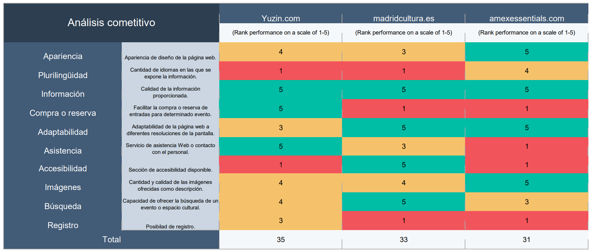

# Trabajo final
Trabajo final 2020-21: Resolución de un problema, caso y/o supuesto práctico.
Descripción :
Repositorio dedicado a la realización del trabajo final de la asignatura Diseño de interfaces de usuario.

Autor:
 * :bust_in_silhouette: Fernando Lojano Mayaguari   

# Mi experiencia UX

Describe con una extensión entre 800-1200 palabras de tu experiencia en IU/UX/Usabilidad, pudiendo
destacar: :
● Aportaciones/contribuciones en contexto de ejercicios/actividades de clase con una valoración
de la calidad de esas contribuciones
● Aportaciones destacables en contexto de prácticas que sean destacables por su calidad o
relevancia
● Otras aportaciones (en ámbitos de otras asignaturas, profesionales, etc.)
Por ejemplo, no vale indicar que se ha hecho un ejercicio etnográfico, sino que se debería explicar qué
se ha aportado ese ejercicio, conclusiones destacadas relacionadas con contenido de asignatura, etc. Lo
mismo con las prácticas.
El resultado de esta parte es tener una (auto) valoración del grado de experiencia adquirido (sabiendo
justificarlo) en el área de UI/UX.

# Caso de estudio: Web Yuzin

## Análisis competencia
Para poder realizar un análisis de competencia correcto, se han escogido dos páginas web cuyo propósito de existencia es el mismo que [Yuzin](http://www.yuzin.com/). Estas páginas son [madridcultura](https://www.madridcultura.es/) y [amexessentials](https://www.amexessentials.com/). Los resultados del análisis obtenidos son:

En esta tabla se puede ver como, a pesar de presentar ciertas desventajas como la ausencia de una sección de accesibilidad y de lenguajes adicionales al principal, la puntuación total que obtiene [Yuzin](http://www.yuzin.com/) es mejor que el resto de las páginas que se han analizado. La página destaca sobre todo en la información que provee así como la sencillez del proceso de contacto con el personal de la página. Pero sobre todo, su utilidad es mayor que las otras dos páginas debido a que incluye la opción directa de compra de tickets para los eventos que muestra.

## Experiencia de Usuario
Se han creado dos personajes ficticios que harán uso de la página:

1. Antonio Palacios
 Antonio Palacios trabaja de asistente telefónico en una compañía telefónica. Es reservado y algo tímido, por lo que no tiene demasiados amigos y casi a perdido el contacto con ellos tras pasar toda la pandemia encerrado en su apartamento. Su lugar de trabajo actual es su propio apartamento, que si bien es lo suficientemente grande para el sólo, no le quita la sensación de encontrarse aislado completamente. Para desconectar del trabajo, le gusta dar largos paseos por su ciudad y, de vez en cuando, asistir a alguna ruta guiada en la que además de realizar ejercicio físico, puede aprender más sobre los lugares por los que está caminando. Si bien le gusta asistir a las rutas guiadas, siente un poco de recelo y vergüenza cada vez que intenta asistir pues lo hace el sólo sin ningún acompañante. Este usuario se dispone a usar la página para buscar información sobre algún evento al que pueda asistir, no obstante, cabe recalcar que era usuario anterior de la versión antigua de la página web, por lo que se encuentra visiblemente impactado debido al nuevo cambio de apariencia y funcionalidad de la página.

 2. Andrea Guelluy
 Andrea es una chica francesa completamente independizada de su familia que vive actualmente con su pareja. Trabaja en la sección de marketing de una grande empresa francesa. No obstante, por seguridad debido a las situaciones médicas actuales, trabaja actualmente a distancia, por lo que le cuesta desconectar del trabajo. Dirige un blog personal sobre viajes y reseñas de los lugares que ha visitado y los eventos a los que ha asistido. Dentro de unas semanas va a tener las vacaciones asignadas de verano y quiere salir de Francia y desconectar completamente del ambiente que le rodea. Para ello, ha reservado un viaje a Granada para ella y su pareja. Quiere buscar eventos o visitas guiadas a los que poder asistir una vez que esten allí y por casualidad, ha acabado en [Yuzin](http://www.yuzin.com/). No conoce la versión anterior de la página por lo que no sabe los cambios realizados durante el re-diseño anterior.

## User Journey map

No se va a realizar ninguna tabla User Journey map pues no se considera necesario.

## Revisión de Usabilidad

